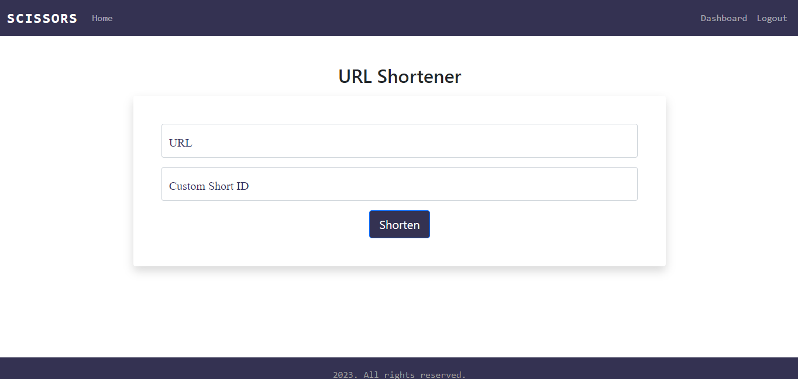

# Scissors

A URL Shortener with custom URL and QR code. My backend engineering capstone project at [AltSchool Africa] (https://altschoolafrica.com/schools/engineering)<br />


## Table of contents

- [Overview](#overview)
  - [The challenge](#the-challenge)
  - [Screenshot](#screenshot)
  - [Links](#links)
- [My process](#my-process)
  - [Built with](#built-with)
  - [What I learned](#what-i-learned)
  - [Useful resources](#useful-resources)
- [To use](#usage)

## Overview

### The challenge

Users should be able to:

- Add a custom url.
- View analytics.
- Generate QR code.
- View number of clicks.
- Login as a user and log out.
- View the optimal layout for the site depending on their device's screen size

### Screenshot



### Links

- Solution URL: (https://github.com/faozziyyah/django-ecommerce-app)
- Live link: (not yet available)

## My process

### Built with

- HTML
- CSS framework
- Flask
- Jinja2 template

### What I learned

- URL Shortening
- QR Code Generation
- Rate Limiting

## To Use

1. Clone this repo
```
git clone https://github.com/faozziyyah/scissor.git
```

2. Activate the virtual environment
```
. venv/Scripts/activate
```

3. Install project packages
```
pip install -r requirements.txt
```

4. Start the server
```
python app.py
```
